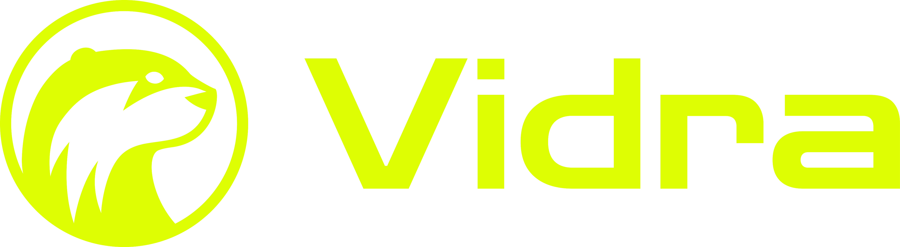

<div align="center">

[](https://vidra.build)

**Build cross-platform desktop apps with React, Vue, or Svelte on a C#/.NET native layer.**

The type-safe, lightweight alternative to Electron (Node), Tauri (Rust), and XAML (MAUI · Avalonia · WPF).

[Quick Start](#quick-start) · [Documentation](#documentation) · [Architecture](docs/architecture.md) · [Capabilities](docs/capabilities.md)

[](https://www.npmjs.com/package/create-vidra-app)
[](https://www.npmjs.com/package/@vidra-dev/sdk)
[](LICENSE)

</div>

---

Vidra lets .NET teams build cross-platform desktop applications with any modern web
framework on a native **C#/.NET** core. The UI is pure web ( **React, Vue, Svelte, Solid**,
your call ) the native layer is C#, and a **type-safe bridge generated from your C# code**
keeps the two sides permanently in sync. Unlike Electron you never touch Node; unlike
Tauri you never touch Rust; unlike MAUI, Avalonia, or WPF you never touch XAML.

> **Alpha.** APIs and templates may change between 0.x releases.

## Why Vidra

- **Stay in C#/.NET.** Your native layer, domain logic, and NuGet libraries are all C#. No second backend language for the team to learn.
- **Bring any web framework.** The UI is a standard web app rendered in a native WebView: React, Vue, Svelte, Solid, or plain HTML. No XAML, no Razor lock-in.
- **Type-safe by codegen.** C# modules are the single source of truth; `vidra-codegen` emits matching TypeScript proxies on every build, so JS and native can't silently drift.
- **Lightweight.** Uses the OS-native WebView (WKWebView / WebView2) instead of bundling Chromium, keeping apps small and memory-light.
- **One bridge, both ways.** Typed `invoke()`, native event push, and reverse-RPC all flow over a single JSON bridge.

## Quick Start

The fastest way to start is the **`create-vidra-app`** scaffolder:

```bash
npm create vidra-app@latest
```

You'll be prompted for a project name and an app ID (reverse-domain). Then launch it:

```bash
cd my-app
npm run dev
```

`npm run dev` (which runs `vidra dev`) starts Vite and the native host for your current
OS together, with hot reload on the web side.

### Prerequisites

- [.NET 10 SDK](https://dotnet.microsoft.com/download)
- The .NET MAUI workload: `dotnet workload install maui`
- [Node.js](https://nodejs.org/) 18+
- macOS targets require Xcode; Windows targets must be built on Windows

Not sure you're set up? Run `npm run doctor` to check your .NET SDK, MAUI workload, and
(on macOS) Xcode, and print the exact command to fix anything missing.

### The `vidra` CLI

The `vidra` CLI is a local dev dependency of each scaffolded app — there's no global
`vidra` to install. Run it from inside your project via the npm scripts or `npx`:

```bash
npm run dev                     # start Vite + native host (hot reload)
npm run build                   # build + package for distribution
npm run doctor                  # verify your environment
npx vidra run                   # launch the native host only
npx vidra dev --target windows  # run a specific desktop target
npx vidra build --target macos  # build & package a specific target
```

## How it works

A single WebView hosts your web UI; the .NET MAUI host owns all native capability. Calls
flow JS → C# as JSON requests over a native message channel (with a custom-scheme
fallback), while responses, native events, and reverse-RPC flow back over the same
bridge. Because the C# modules' argument/result types are the source of truth, the SDK's
TypeScript proxies are generated to match.

See **[Architecture](docs/architecture.md)** for the full diagram and host model, and
**[Interop Protocol](docs/interop-protocol.md)** for the wire format.

## Type safety via codegen

Native modules are plain C# classes; their argument/result records define every call:

```csharp
[BridgeModule("filesystem")]
public sealed class FileSystemModule : BridgeModuleBase
{
    [BridgeMethod("readText")]
    public async Task<ReadTextResult> ReadTextAsync(ReadTextArgs args, CancellationToken ct)
        => new(await File.ReadAllTextAsync(args.Path, ct));
}
```

On build, `vidra-codegen` scans the compiled assemblies and emits matching, fully-typed
TypeScript proxies so your editor autocompletes both arguments and results:

```ts
import { filesystem } from "@vidra-dev/sdk";

// `path` is required and typo-checked; `content` is inferred as `string`.
const { content } = await filesystem.readText({ path: "/tmp/notes.txt" });
```

Full pipeline and C# → TS type mapping: **[Type safety & codegen →](docs/architecture.md#type-safety--codegen)**

## Documentation

| Page | What's inside |
|------|---------------|
| [Architecture](docs/architecture.md) | Host model, bridge design, and the codegen pipeline |
| [Interop Protocol](docs/interop-protocol.md) | JSON envelopes, transports, and error codes |
| [Capabilities](docs/capabilities.md) | Every built-in module and its typed methods |
| [Testing](docs/testing.md) | How the bridge and codegen output are tested |

## Packages

| Package | Description |
|---------|-------------|
| [`create-vidra-app`](https://www.npmjs.com/package/create-vidra-app) | Scaffolder + the `vidra` CLI (dev / run / build / doctor) |
| [`@vidra-dev/sdk`](https://www.npmjs.com/package/@vidra-dev/sdk) | Framework-agnostic TypeScript SDK and generated proxies |

## Targets

| Platform | Status |
|----------|--------|
| Windows | Supported |
| macOS | Supported |

Mobile (iOS / Android) is on the roadmap as the .NET MAUI foundation makes it a natural
next target.

## License

[MIT](LICENSE) · [Report an issue →](https://github.com/rzamfiriu/vidra/issues)
