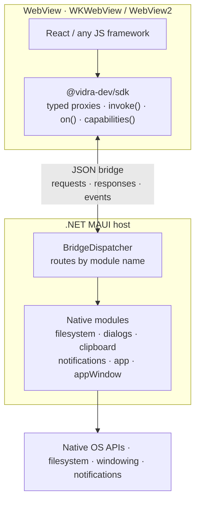

# Vidra

Cross-platform application framework: **React UI + .NET MAUI native layer**.

Build desktop and mobile apps with a web-based UI and native C# capabilities, shipped from a single codebase.

## Architecture



The UI stack is pure web. Native capability lives in .NET. Calls flow JS → C# as JSON
requests, while responses, native events, and reverse-RPC flow back over the same bridge.
The C# modules' argument/result types are also the single source of truth for the SDK's
generated TypeScript proxies — see [Type safety via codegen](#type-safety-via-codegen).

## Repository Layout

```
src/
  cli/create-vidra-app/        # Scaffold CLI, vidra CLI, and starter template
  bridge/Vidra.Bridge/        # C# bridge runtime, dispatcher, message protocol
  host/Vidra.Host.Maui/       # MAUI app shell with WebView host
  modules/
    Vidra.Modules.FileSystem/  # File read/write/list
    Vidra.Modules.Dialogs/     # Alert, confirm, prompt
    Vidra.Modules.Clipboard/   # Copy/paste
    Vidra.Modules.Notifications/ # Local notifications
    Vidra.Modules.AppLifecycle/  # App info, theme
    Vidra.Modules.Windowing/     # Primary window title/size/state
  sdk/vidra-js/               # TypeScript SDK for the JS side
samples/
  workspace-manager/           # Sample app (planned)
docs/                          # Architecture, protocol, capabilities
tools/                         # CLI and build helpers (planned)
```

## Quick Start

### Prerequisites

- .NET 10 SDK with MAUI workload
- Node.js 20+
- Windows development must be run from Windows with the MAUI Windows workload installed

### Development

```bash
# From a scaffolded Vidra app root
npm run dev
```

`vidra dev` starts Vite and launches the native desktop host for the current OS.

To force a desktop target explicitly:

```bash
vidra dev --target macos
vidra dev --target windows
```

### Production Build

```bash
vidra build
vidra build --target macos
vidra build --target windows
```

On macOS, both `vidra dev` and `vidra build --target macos` try to re-sign the generated Mac Catalyst `.app`
with a local signing identity before launch or packaging. By default Vidra prefers the first available
`Apple Development` identity, and you can override that selection with `VIDRA_MACOS_CODESIGN_KEY`.

For actual end-user distribution, you should still use the appropriate Apple distribution signing flow
and notarization.

## JS SDK Usage

The SDK ships **generated, fully-typed proxies** for every native module, so calls are
checked at compile time and your editor autocompletes both arguments and results:

```typescript
import { filesystem, appWindow, vidra } from '@vidra-dev/sdk';

// `path` is required and typo-checked; `content` is inferred as `string`.
const { content } = await filesystem.readText({ path: '/tmp/notes.txt' });

// `state` is a typed union ('restored' | 'maximized' | 'minimized' | 'fullscreen'),
// not a bare string.
const { state } = await appWindow.getCurrent();

// Listen for native events
vidra.on('app.resume', () => console.log('App resumed'));

// Discover available modules at runtime
const caps = await vidra.capabilities();
```

### Type safety via codegen

C# is the single source of truth for the bridge contract. Native modules are plain C#
classes annotated with `[BridgeModule]` / `[BridgeMethod]`, and their argument/result
records define the shape of every call:

```csharp
public record ReadTextArgs(string Path);
public record ReadTextResult(string Content);

[BridgeModule("filesystem")]
public sealed class FileSystemModule : BridgeModuleBase
{
    [BridgeMethod("readText")]
    public async Task<ReadTextResult> ReadTextAsync(ReadTextArgs args, CancellationToken ct)
    {
        var content = await File.ReadAllTextAsync(args.Path, ct);
        return new ReadTextResult(content);
    }
}
```

On build, `vidra-codegen` scans the compiled assemblies and emits matching TypeScript
proxies and interfaces (`ReadTextArgs`, `ReadTextResult`, …). Because the TS types are
generated from the C# definitions, the JS and native sides can never silently drift.
See [docs/architecture.md](docs/architecture.md#type-safety--codegen) for the full pipeline.

Need a module the proxies don't cover yet? The lower-level, stringly-typed escape hatch
is always available:

```typescript
const { content } = await vidra.invoke<{ content: string }>(
  'filesystem',
  'readText',
  { path: '/tmp/notes.txt' },
);
```

## Targets

| Platform    | Status     |
|------------|------------|
| Windows    | Supported  |
| macOS      | Supported  |

## License

MIT
