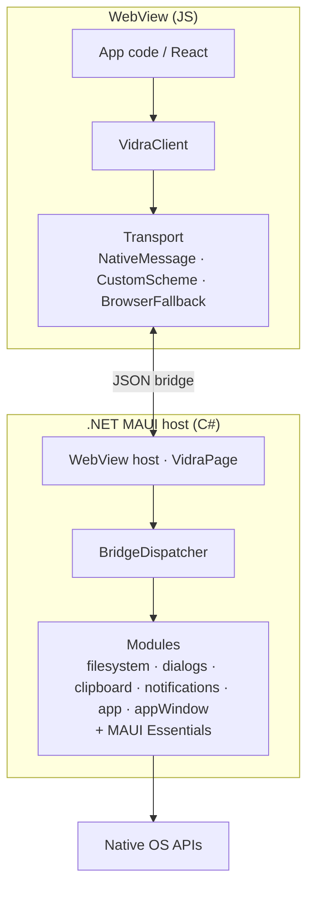

# Architecture

## Overview

Vidra uses a single `WebView` control as the host for all platforms, in both development and production. The framework owns the entire bridge between JavaScript and C#.



The transport is auto-detected: the native message channel is preferred, with the
`vidra://bridge` custom scheme as a fallback and a browser stub for UI-only development.
The bridge is bidirectional — see the message round-trip in
[interop-protocol.md](./interop-protocol.md) for the wire format, and
[Type Safety & Codegen](#type-safety--codegen) for how the typed SDK proxies are generated.

## Host Model

- **Development**: the WebView loads `http://localhost:5173` (or a configurable `VIDRA_DEV_URL`), allowing Vite HMR and standard browser dev tools. `vidra dev` launches the host under `dotnet watch`, so supported C# edits hot reload into the running process (rude edits rebuild + relaunch automatically); after each applied delta the host pushes a `vidra.hotReloaded` bridge event so the UI can react. On toolchains without `dotnet watch` support for the target, the CLI falls back to a one-shot build + direct launch (`vidra dev --no-hot-reload` forces this).
- **Production**: the WebView loads bundled static assets from the app package (`Resources/Raw/wwwroot/index.html`).

The same bridge works in both modes. For JS→C# traffic it prefers a first-class
native message channel (WKWebView script messages / WebView2 web messages) and
falls back to a custom URL scheme (`vidra://bridge`) intercepted by the MAUI
`Navigating` event when no native channel is available. See
[interop-protocol.md](./interop-protocol.md) for details.

## Bridge Protocol

All communication uses JSON envelopes.

### JS → C# (request)

```json
{
  "id": "req_1_1710000000000",
  "contract": "filesystem",
  "member": "readText",
  "payload": { "path": "/tmp/f.txt" }
}
```

### C# → JS (response)

```json
{
  "id": "req_1_1710000000000",
  "success": true,
  "data": { "content": "file contents here" }
}
```

### C# → JS (event push)

```json
{
  "contract": "connectivity",
  "member": "changed",
  "payload": { "access": "internet", "profiles": ["wifi"] }
}
```

## Contract System

Vidra has three safe contract directions:

- **Native contracts** are implemented in C# and invoked by JavaScript.
- **Event contracts** are declared and emitted by C# for JavaScript subscribers.
- **JS contracts** are declared in C#, implemented in JavaScript, and invoked by C#.

Native modules still implement `IBridgeModule` and are registered in `MauiProgram.cs`. Protocol v2 routes all three flows by explicit `contract` and `member` fields.

## JS SDK

The TypeScript SDK (`@vidra-dev/sdk`) wraps the transport layer and exposes generated native proxies, generated event subscriptions, generated JS-handler registries, and `capabilities()`. Dynamic traffic is isolated under `vidra.unsafe.invoke/on/handle`. The SDK auto-detects whether it is running inside a native host or a plain browser and falls back to console logging in browser-only mode.

The SDK ships **generated, typed proxies** for each built-in module (`filesystem`, `dialogs`, `clipboard`, `notifications`, `appWindow`, `app`) plus the MAUI Essentials modules (`secureStorage`, `preferences`, `device`, `share`, `browser`, `launcher`, `email`, `filePicker`, `textToSpeech`, `connectivity`, `battery`, `essentials`). Event methods such as `connectivity.onChanged`, `battery.onChanged`, `appWindow.onResized`, and `runtime.onHotReloaded` are emitted into the same proxies. See the full list in [capabilities.md](./capabilities.md).

## Type Safety & Codegen

C# is the single source of truth for every safe bridge contract. Native modules use `[BridgeModule]` / `[BridgeMethod]`; event and JS contracts use annotated interfaces:

```csharp
public record ReadTextArgs(string Path);
public record ReadTextResult(string Content);

[BridgeModule("filesystem")]
public sealed class FileSystemModule : BridgeModuleBase
{
    [BridgeMethod("readText")]
    public Task<ReadTextResult> ReadTextAsync(ReadTextArgs args, CancellationToken ct) { /* ... */ }
}

[BridgeEventContract("connectivity")]
public interface IConnectivityEvents
{
    [BridgeEvent("changed")]
    void Changed(ConnectivityStatus payload);
}

[JsContract("counter")]
public interface ICounterJs
{
    [JsMethod("increment")]
    Task<int> IncrementAsync();
}
```

The Roslyn generator runs during compilation and emits typed event tokens, `Bridge.Js()` clients, AOT-safe JSON codecs, diagnostics, and an immutable contract manifest registration. `vidra-codegen` (`src/tools/Vidra.CodeGen`) then scans compiled assemblies with `MetadataLoadContext` and emits:

- `manifest.json`: native methods, events, JS methods, schemas, and a deterministic fingerprint.
- Typed TypeScript native/event proxies and JS-handler registries plus a barrel `index.ts`.

C# types map to idiomatic TypeScript:

| C# | TypeScript |
|----|------------|
| `record` / class with properties | `interface` |
| `string`, `Guid`, `DateTime` | `string` |
| numeric types | `number` |
| `bool` | `boolean` |
| `T[]`, `List<T>`, `IReadOnlyList<T>` | `T[]` |
| `Dictionary<string, T>` | `Record<string, T>` |
| `enum` | camelCase string-literal union (e.g. `"restored" \| "maximized"`) |
| `enum[]` | parenthesized union array (e.g. `("wifi" \| "ethernet")[]`) |
| `Nullable<T>` (e.g. `int?`) | optional `T \| null` |
| nullable reference (e.g. `string?`, `Foo?`) | optional `T \| null` |

The generated proxy turns the records above into:

```ts
export interface ReadTextArgs { path: string; }
export interface ReadTextResult { content: string; }

export class FilesystemProxy {
  readText(args: ReadTextArgs): Promise<ReadTextResult> {
    return this.client.unsafe.invoke("filesystem", "readText", args);
  }
}
```

Enums cross the wire as their **camelCase string name**, not a numeric value. Native serialization and generated AOT codecs share that policy, so JSON matches the generated string-literal unions. Nullable values (`int?`, `string?`) are omitted when null, which the emitter reflects as optional `field?: T | null`.

Built-in contracts are generated into the SDK. App and opted-in third-party contracts are generated into the app’s configured `VidraTsOutputDir` by the packaged `buildTransitive` target. Generated output is deterministic and committed; `VidraCodeGenCheck` fails CI when it is stale.

At WebView startup, protocol version 2 compares separate core and app manifest fingerprints. A mismatched SDK, native package set, or committed app output fails visibly before bridge traffic starts. The supported claim is therefore: **end-to-end typed contracts, with an explicit unsafe escape hatch**.
