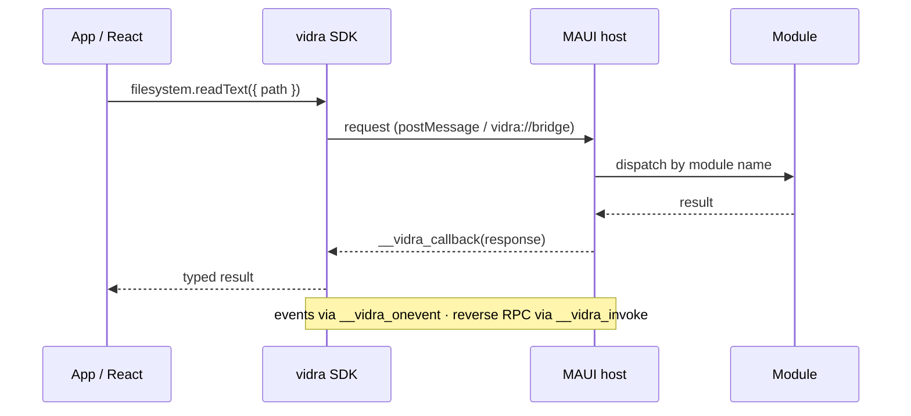

# Interop Protocol

## Message Round-Trip

A typical typed call flows through the SDK, across the transport, into the dispatcher,
and back. Events and reverse RPC reuse the same channel in the opposite direction.



## Transport

### JS → C#

The SDK auto-selects the best available channel at runtime:

1. **Native message channel (preferred).** A first-class, binary-safe channel with
   no payload-size limit:
   - Apple (WKWebView): `window.webkit.messageHandlers.vidra.postMessage(frame)`,
     received by a `WKScriptMessageHandler` on the host.
   - Windows (WebView2): `window.chrome.webview.postMessage(frame)`, received by
     `CoreWebView2.WebMessageReceived` on the host.

   Because a single channel carries both directions of traffic, messages are
   tagged frames so requests and reverse-RPC responses can be told apart:

   ```json
   { "kind": "request", "data": { ...request envelope... } }
   { "kind": "reverse", "data": { ...reverse response... } }
   ```

2. **Custom-scheme navigation (fallback).** A hidden iframe navigates to
   `vidra://bridge?payload=<url-encoded-json>` (or `vidra://reverse?payload=...`),
   intercepted by the MAUI `WebView.Navigating` handler, which cancels the
   navigation and dispatches the request. This path is used when the native
   channel is unavailable. It is subject to URL-length limits, so large payloads
   (e.g. file contents) require the native channel.

### C# → JS

C# sends responses, events, and reverse-RPC calls back via
`WebView.EvaluateJavaScriptAsync`, calling global functions on the `window` object:

- `window.__vidra_callback(response)` for request responses
- `window.__vidra_onevent(event)` for pushed events
- `window.__vidra_invoke(request)` for reverse RPC calls

## Request Envelope

| Field     | Type    | Required | Description                         |
|-----------|---------|----------|-------------------------------------|
| `id`      | string  | yes      | Unique correlation ID               |
| `module`  | string  | yes      | Target module name                  |
| `method`  | string  | yes      | Method to invoke on the module      |
| `payload` | object  | no       | Arguments for the method            |

## Response Envelope

| Field     | Type    | Required | Description                         |
|-----------|---------|----------|-------------------------------------|
| `id`      | string  | yes      | Matching request correlation ID     |
| `success` | boolean | yes      | Whether the call succeeded          |
| `data`    | any     | no       | Return value on success             |
| `error`   | object  | no       | `{ code, message }` on failure      |

## Error Codes

| Code               | Meaning                                        |
|--------------------|-------------------------------------------------|
| `PARSE_ERROR`      | The JSON envelope could not be deserialized     |
| `MODULE_NOT_FOUND` | No module registered with the requested name    |
| `MODULE_ERROR`     | The module threw an exception during handling   |

## Event Envelope

| Field   | Type   | Required | Description                  |
|---------|--------|----------|------------------------------|
| `event` | string | yes      | Dot-separated event name     |
| `data`  | any    | no       | Event payload                |
