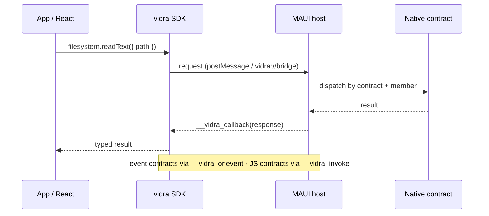

# Interop Protocol

## Message round-trip

A safe call flows through generated APIs, across the transport, into the dispatcher, and back. Event contracts and JS contracts reuse the bridge in the opposite direction.



## Transport

### JS → C#

The SDK auto-selects the best available channel:

1. **Native message channel (preferred).**
   - Apple: `window.webkit.messageHandlers.vidra.postMessage(frame)`
   - Windows: `window.chrome.webview.postMessage(frame)`

   Tagged frames distinguish native requests from JS-contract responses:

   ```json
   { "kind": "request", "data": { "...": "request envelope" } }
   { "kind": "reverse", "data": { "...": "JS-contract response" } }
   ```

2. **Custom-scheme fallback.** Hidden iframes navigate to `vidra://bridge?payload=...` or `vidra://reverse?payload=...`. URL limits make the native channel mandatory for large payloads.

### C# → JS

C# calls global WebView functions through `EvaluateJavaScriptAsync`:

- `window.__vidra_callback(response)` for native-contract responses
- `window.__vidra_onevent(event)` for event contracts
- `window.__vidra_invoke(request)` for JS contracts
- `window.__vidra_initialize(handshake)` for startup negotiation

## Startup negotiation

Protocol v2 initializes after WebView navigation:

```json
{
  "protocolVersion": 2,
  "coreFingerprint": "sha256",
  "appFingerprint": "sha256"
}
```

The SDK compares the protocol version and both generated manifest fingerprints before accepting bridge traffic. Core contracts come from matched SDK/native packages; app contracts come from the consuming host and committed generated TypeScript.

## Native request envelope

| Field | Type | Required | Description |
|---|---|---|---|
| `id` | string | yes | Unique correlation ID |
| `contract` | string | yes | Target native contract |
| `member` | string | yes | Native member to invoke |
| `payload` | object | no | Typed member payload |

## Response envelope

| Field | Type | Required | Description |
|---|---|---|---|
| `id` | string | yes | Matching correlation ID |
| `success` | boolean | yes | Whether the call succeeded |
| `data` | any | no | Return value on success |
| `error` | object | no | `{ code, message }` on failure |

## Event envelope

| Field | Type | Required | Description |
|---|---|---|---|
| `contract` | string | yes | Event contract |
| `member` | string | yes | Event member |
| `payload` | object | no | Typed event payload |

## JS-contract request envelope

| Field | Type | Required | Description |
|---|---|---|---|
| `id` | string | yes | Unique correlation ID |
| `contract` | string | yes | JavaScript contract |
| `member` | string | yes | JavaScript member |
| `payload` | object | no | Typed member payload |

The JS→C# result uses the response envelope. A bridge-wide 30-second timeout prevents orphaned correlations; caller cancellation can finish sooner. Neither path aborts a JavaScript handler already running.

## Error codes

| Code | Meaning |
|---|---|
| `PARSE_ERROR` | The JSON envelope could not be deserialized |
| `NATIVE_CONTRACT_NOT_FOUND` | No native contract has the requested name |
| `NATIVE_MEMBER_ERROR` | A native member rejected or failed the request |
| `JS_HANDLER_NOT_FOUND` | No JavaScript implementation is registered |
| `JS_HANDLER_ERROR` | The JavaScript implementation threw or rejected |
| `JS_RESPONSE_INVALID` | A JS-contract response could not be decoded |
| `BROWSER_ONLY` | A native contract was invoked outside the host |

## Unsafe traffic

Generated APIs are manifest-backed and fingerprinted. Dynamic traffic is deliberately separated under `vidra.unsafe.invoke/on/handle` and `Bridge.Unsafe`; it uses the same envelopes but is not part of the generated manifest.
